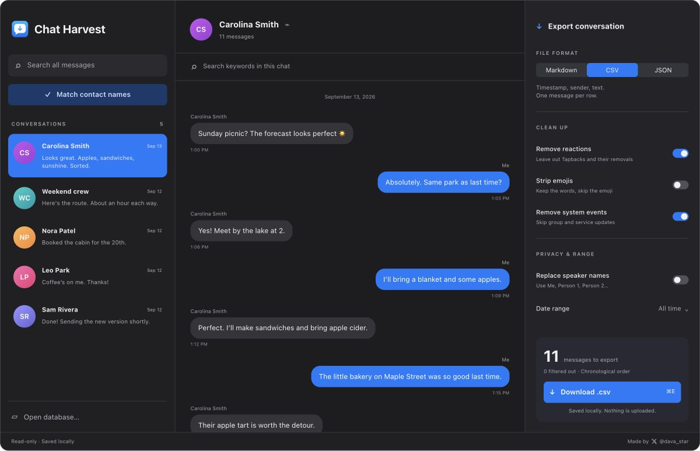

<p align="center"></p>
<h1 align="center">Chat Harvest</h1>
<p align="center">Your iMessages. Ready to export.</p>
<p align="center">Export iMessage conversations as clean CSV, Markdown, or JSON for your AI, spreadsheet, or personal archive. Free and local on your Mac.</p>
<p align="center"><a href="https://davidstor.github.io/chat-harvest/">Website & interactive demo</a> · <a href="https://github.com/DavidStor/chat-harvest/releases/latest">Download for Mac</a> · <a href="GUIDE.md">Setup guide</a></p>



## Pick a chat. Take a clean copy.

- **Take a clean copy.** CSV, Markdown, or JSON with readable timestamps, speakers, and text. No database IDs or opaque GUID columns.
- **Choose what matters.** Date ranges, optional emoji stripping, reaction and system-event removal, and blank/dot-only message cleanup.
- **Keep media in the story.** `[photo]`, `[video]`, `[sticker]`, and other placeholders preserve their place without copying files.
- **Recognize your people.** Optional local Contacts matching, custom chat labels, or replacement speaker names for exports.
- **Search the words you remember.** `apple` matches `Apple`, `apples`, and `pineapple`. Case- and accent-insensitive keyword search within one chat or across your database.
- **Keep the context.** Yellow highlights, an orange active match, and previous/next navigation. Search the whole conversation while a bounded timeline keeps rendering manageable.

Useful for finding an old recommendation, saving a meaningful conversation, or giving your preferred AI a readable project or trip history. The app itself does not connect to an AI service.

## Download & install

**[Download Chat Harvest 1.0 for Apple Silicon](https://github.com/DavidStor/chat-harvest/releases/latest/download/Chat-Harvest-macOS-arm64.zip)** · macOS 13 or later · [Release notes & checksums](https://github.com/DavidStor/chat-harvest/releases/latest)

1. Unzip the download and move **Chat Harvest.app** to Applications.
2. Open it, then choose your local `chat.db` copy. See the [database setup instructions](GUIDE.md#prepare-your-database).
3. Try **File → Try Demo Conversations** to explore without using your own messages.

The app is ad-hoc signed, **not notarized by Apple**. macOS may block its first launch. If you decide to trust the app after reviewing its source and release, follow [Apple’s instructions for opening an app from an unidentified developer](https://support.apple.com/en-us/102445). A source build is also available below. The prebuilt download supports Apple Silicon; Intel users can try a native source build, which has not been tested on Intel hardware.

## A simpler export

```csv
timestamp,sender,text
2026-09-13 13:09:00,Me,I'll bring a blanket and some apples.
2026-09-13 13:12:00,Carolina Smith,Perfect. I'll make sandwiches and bring apple cider.
2026-09-13 13:24:00,Carolina Smith,[photo]
```

Timestamps use `yyyy-mm-dd hh:mm:ss` in your Mac’s local timezone. CSV uses UTF-8 with a byte-order mark and one physical row per message. Markdown and JSON preserve readable paragraphs. [Download the fictional sample CSV](docs/assets/sample-conversation.csv).

Search always checks the original full conversation. Cleanup and date filters control the download independently; searching does not limit your export to matching messages.

## Local by design

No account, analytics, upload endpoint, or network SDK. SQLite is opened read-only. Optional contact matching happens on your Mac. The app stores only your last database path and custom chat labels in local preferences; matched contact names stay in memory. Exported files go wherever you choose to save them.

Replacing speaker names does **not** redact personal details from message text. Review an export before sharing it with anyone or uploading it to an AI.

Chat Harvest reads what is in the selected database. It does not retrieve iCloud-only history, recover deleted content, reproduce edit histories, or export media files. Unsupported message bodies get explicit placeholders. It is a transcript tool, not a complete backup or forensic archive.

## Build & test

Requires macOS and Xcode Command Line Tools. No third-party Swift packages.

```sh
git clone https://github.com/DavidStor/chat-harvest.git
cd chat-harvest
./build.sh
./test.sh
```

The build produces `Chat Harvest.app` for the host Mac’s architecture with an ad-hoc signature. Source is SwiftUI, Foundation, Contacts, and SQLite, with a small Objective-C bridge for archived message bodies. `./release.sh` builds, tests, verifies the signature, and creates a ZIP and SHA-256 checksum under `build/release/`.

Tests cover Unicode, CSV/JSON serialization, archive decoding, SQLite joins, media placeholders, cleanup filters, date boundaries, read-only access, keyword search, cancellation, and timeline paging. A 50,000-message synthetic search checks main-thread responsiveness and rejects stale results after rapid typing, clearing, and switching chats.

## Contributing

Issues and small focused pull requests are welcome. Include your macOS version and reproduction steps. **Never attach your real database, personal exports, or unredacted screenshots to a public issue.** Use the demo conversations or a minimal fictional example. See [CONTRIBUTING.md](CONTRIBUTING.md).

There are existing alternatives. This project focuses on a small native interface and simple transcripts; it does not claim to be the only iMessage exporter. [Community requests, positioning, and alternatives →](RESEARCH.md)

[MIT license](LICENSE). Made by [@dava_star on X](https://x.com/dava_star). Independent project, not affiliated with Apple.
